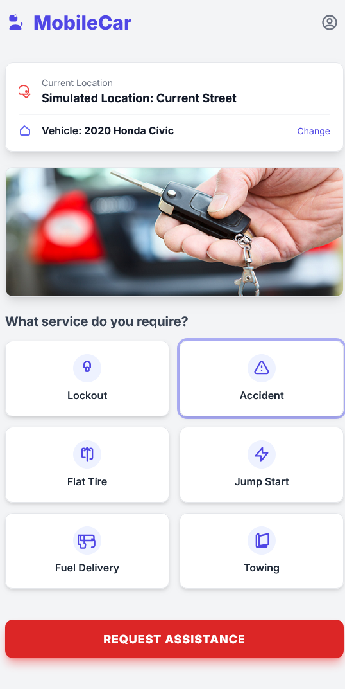

# MobileCar App
## On-Demand Automotive Service Platform (Portfolio Case Study)

---
### Author:
Built and developed by **Marjory D. Marquez**

#### Portfolio Project Note
**This work is a key component of my professional portfolio.** Some sections of the source code (primarily core business logic and secrets) have been deliberately omitted to protect proprietary and copyrighted material, focusing the repository on architecture and front-end implementation.

---

## Case Study: Addressing Roadside Service Inefficiency

### The Problem

Traditional roadside assistance often suffers from a lack of **transparency** (unknown wait times, surprise costs) and **efficiency** (manual dispatching, lack of real-time tracking). This results in frustrated customers and inefficient use of technician time.

---

## Key Features & Objectives (The Solution)


| Category | Objective/Feature | Description |
| :--- | :--- | :--- |
| **Efficiency** | **Real-Time Tracking** | GPS-based location services and API polling for minute-by-minute status updates of the service driver, reducing customer anxiety. |
| **Convenience** | **On-Demand Service** | Handles service requests for **Locksmith**, **Flat Tire**, and **Emergency** (Jumpstart/Fuel) services directly at the customer's vehicle location. |
| **Transparency** | **Digital-First Payments** | Integrated payment simulation, transparent fixed pricing, and instant digital receipt generation upon service completion. |
| **Management** | **Driver Dashboard** | Separate, mobile-optimized interface for technicians to toggle **Online/Offline** status, accept jobs, update status, and track daily earnings. |
| **User Experience** | **Mobile-First PWA** | Responsive design using **Tailwind CSS** with full **Light/Dark Mode** support for accessibility. |

---

### The Solution (MobileCar)

**MobileCar** was developed as a comprehensive, full-stack web application designed to modernize and streamline **on-demand automotive emergency services**. Its primary purpose is to connect customers needing roadside help (flat tire, jumpstart, locksmith) with nearby mobile service providers in real-time, leveraging modern web technologies to ensure efficiency, transparency, and a superior mobile-first user experience.

---

## On-Demand Automotive Service Platform

**MobileCar** is a comprehensive, full-stack web application designed to streamline **on-demand automotive emergency services**. Built with a focus on efficiency, transparency, and a mobile-first user experience, it connects customers needing roadside assistance with nearby mobile service providers in real-time.


---

## Technology Stack (The Execution)

This project is built using a modern full-stack architecture, demonstrating proficiency in both client-side design and server-side business logic.

| Component | Technology | Role |
| :--- | :--- | :--- |
| **Frontend** | **HTML5, Tailwind CSS, Vanilla JavaScript (ES6 Modules)** | Mobile-first UI, presentation logic, and API consumption. Demonstrates mastery of core web technologies for high performance. |
| **Backend** | **Node.js, Express** | RESTful API creation, business logic, request matching, and real-time status updates (simulated). Chosen for its non-blocking I/O model suited for real-time applications. |
| **Database** | **In-Memory (Simulated)** | Stores service request and driver status data. (Designed to demonstrate architecture ready for seamless integration with a NoSQL database like **MongoDB**). |
| **Tools** | **Git, npm, CORS, dotenv** | Development environment, dependency management, and secure configuration handling. |
| **MongoDB**. |


---


***

## Application Overview Images Screenshots

These images demonstrate key features and the overall user interface of the MobileCar Application.

### 1. Main Page




### 2. Profile Information Page


### 3. Car Details Information Page


### 4. Driver Dashboard


---

## Getting Started

Follow these steps to set up and run the full-stack application on your local machine.

### Prerequisites

You must have **Node.js** and **npm** installed.

### 1. Installation

1.  **Clone the Repository:**
    ```bash
    git clone [https://github.com/YOUR_USERNAME/MobileCar.git](https://github.com/YOUR_USERNAME/MobileCar.git)
    cd MobileCar
    ```
2.  **Install Backend Dependencies:**
    ```bash
    cd server
    npm install
    ```
3.  **Check Configuration:** Ensure the **`.env`** file in the `server/` directory is present and configured for the API port (default is 3000).

### 2. Run the Application

1.  **Start the Backend API:**
    ```bash
    npm run dev
    # API is running on http://localhost:3000
    ```
    Keep this terminal window open.

2.  **Run the Frontend:**
    Open the frontend file in your web browser:
    ```bash
    # Open this file path in your browser
    /path/to/MobileCar/public/index.html
    ```
    *(For the best experience, use **F12** to open Developer Tools and enable **Mobile View** in your browser.)*

---

## How to Use the Demo

The application uses floating buttons at the bottom-right of the screen to switch between user roles.

| Button | Role | Purpose |
| :--- | :--- | :--- |
| **Customer View** | **Vehicle Owner** | Submit new service requests and track a driver's progress in real-time. |
| **Driver View** | **Mobile Technician** | Toggle **Online/Offline** status, accept pending jobs, and view current earnings. |

To see a full cycle, start as a **Customer**, submit a request, then switch to the **Driver View**, go **Online**, and accept the new job from the queue.
